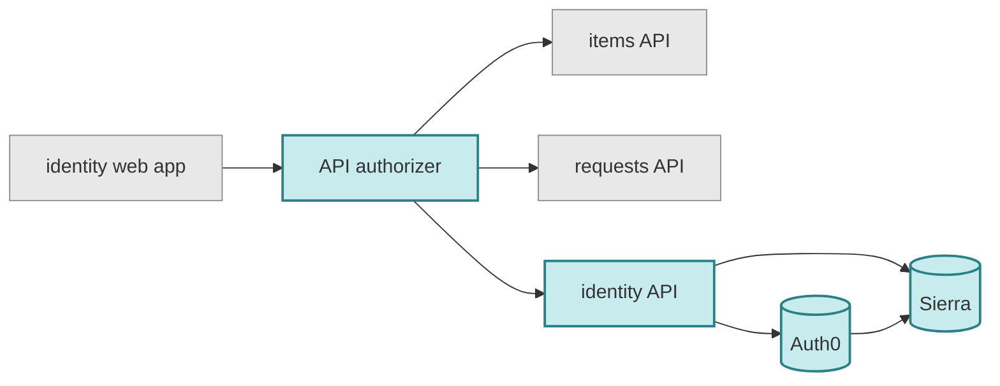

# identity

[](https://buildkite.com/wellcomecollection/identity)

This repo contains identity-related services for Wellcome Collection users.
This allows users to sign in on wellcomecollection.org and keeps their personal information safe.


## Key services



The canonical store of user information is **Sierra**, our library management system.

We put **Auth0** in front of Sierra, which provides an additional layer of control and security.
We use some pieces of Auth0 as-is or with light customisation (e.g. the login page); in other places we run our own code inside Auth0 (e.g. to push any changes to user data back into Sierra).

Our services don't interact with Auth0 or Sierra directly; instead they use the **identity API**.
This includes APIs for retrieving user data, updating personal details, changing passwords, and so on.

Access to the identity API is gated by the **API authorizer**.
It checks that a caller is allowed to perform the requested action (e.g. that a user is looking up their own information, and not somebody else's).

The API authorizer also gates access to the **items API** and **requests API**, which are used to manage items which users have [requested from library stores][stores].
These APIs are defined in the [catalogue-api repo][api].

Users experience these services/APIs through the **identity web app**, which is defined in the [wellcomecollection.org repo](https://github.com/wellcomecollection/wellcomecollection.org).

[stores]: https://wellcomecollection.org/pages/X_2eexEAACQAZLBi
[api]: https://github.com/wellcomecollection/catalogue-api


## Developing

Installing the project dependencies (ie `yarn` at the root) will also set up [lint-staged](https://github.com/okonet/lint-staged) to run [prettier](https://prettier.io/) as a pre-commit hook. This formatting is also checked in CI. You might also want to [set up your editor](https://prettier.io/docs/en/editors.html) to run prettier on save too!

### Terraform

This project uses [Terraform workspaces](https://www.terraform.io/docs/language/state/workspaces.html) to accomodate multiple environments.

You will need to switch workspace to plan/apply in a particular environment:

```
> terraform workspace list
* default
  prod
  stage

> terraform workspace select stage
Switched to workspace "stage".
```

### Continuous Integration

This project builds in Buildkite where there are pipelines to cover build and deployment through stage and production environments.

- [Identity](https://buildkite.com/wellcomecollection/identity): Test and build artifacts
- [Identity: Deploy Stage](https://buildkite.com/wellcomecollection/identity-deploy-stage): Deploy to staging environment and run smoke tests
- [Identity: Deploy Prod](https://buildkite.com/wellcomecollection/identity-deploy-prod): Deploy to production environment and run smoke tests

[](https://buildkite.com/wellcomecollection/identity)

Merged pull requests will be automatically deployed to the staging environment, but a production deploy requires manual unblocking in Buildkite.

#### Build images

The build uses a docker image generated from the `Dockerfile` in the `.buildkite` folder.

When this image is updated it is necessary to push this image to ECR manually.

```
# Log in to ECR via docker (you may need to use a different profile)
aws ecr get-login-password --region eu-west-1 --profile identity | docker login --username AWS --password-stdin 770700576653.dkr.ecr.eu-west-1.amazonaws.com

# Build the latest image
docker build . -t 770700576653.dkr.ecr.eu-west-1.amazonaws.com/uk.ac.wellcome/identity-build:latest

# Push the latest image
docker push 770700576653.dkr.ecr.eu-west-1.amazonaws.com/uk.ac.wellcome/identity-build:latest
```
